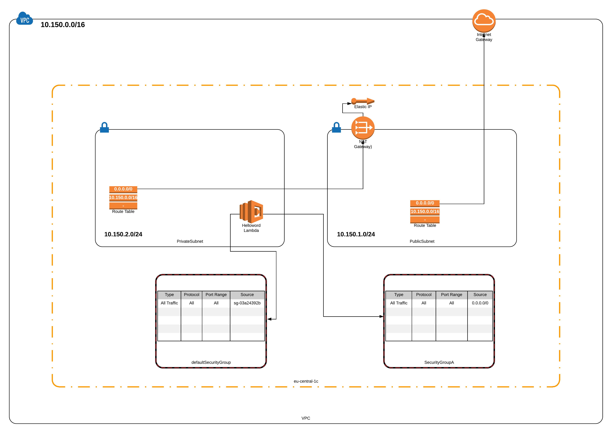
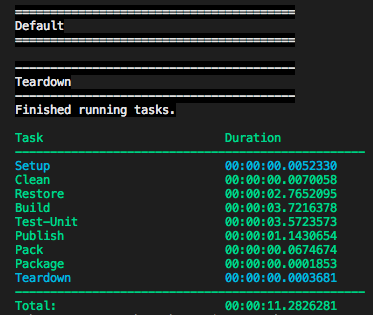

# Lambda in VPC

## What are lambdas

AWS Lambda enables you to execute your code without having to run a server.  To put in simply, it's a serverless technology.  This doesn't mean there aren't any servers involved in the setup.  Instead, AWS manage the server workloads so you don't have to.

Some of the main benefits of using lambdas are:

1. Less support overheads - as the server workloads are not your responsibility, you don't have to worry about patching them or the general health of the servers (high memory or high CPU utilization or storage usage).  You can just trust that your lambdas will always have a stable server to run on.
2. Cost of running vs Always on VMs - With EC2 instances running a web application, they are generally always on so as to make the web application available at all times.  EC2 instances charge for every second that the VM is running, meaning your potentially could have quite a large bill come the end of the month for your server work loads.  You will be charged regardless of whether anyone is using your application or not.  There are also other costs to consider such as storage costs and static IP addresses.  Lambdas only charge you for calls to the lambda which run for more than 3 seconds.  This means that if your application is made up of small short running functions, lambdas could significantly reduce your operational costs.

## What are VPCs

A VPC (Virtual private cloud), is a virtual private network in AWS.  It works in the same way as any other network, allowing you to subnet, create VPNs, configure routing via Route Tables and manage security of the network using ACLs (Access Control List) and Security Groups.  You can also implement NAT (Network Address Translation) for your private subnets

## Use cases for using Lambdas inside of VPCs / Lambda default behaviour

By default, lambdas have internet access allowing them to communicate with any public resources.  This works well for many use cases but there are times when you will need your lambda to access resources inside your VPC.  An example of this is would be a requirement to access a VPN tunnel inside a VPC.  

You would need to add the VPC configuration to the lambda in order for this to work. By adding the VPC configuration to the lambda, it will loose its internet connectvity that lambdas usually have by default

## Demo

In this demo, we will look at how to configure a lambda to work within a VPC, as well as grant it internet access to allow it to access resources outside of the VPC.

## Architecture overview and explanantion

To implement this demo, we will require a:

  1. VPC
  2. Public subnet and a private subnet inside the VPC
  3. NAT gateway
  4. Internet gateway
  5. Elastic IP
  6. Route table for each of the subnets
  7. Security group x 2
  8. Lambda function (a simple helloworld sample function generated from SAM template will suffice)

The VPC will consists of 2 subnets, one public and one private with an internet gateway associated with the VPC.  

The public subnet will have a NAT gateway associated with it and the route table for this subnet will have a default route pointing at the internet gateway.

The private subnet's route table will have a default route pointing to the NAT gateway that is associated with the public subnet.

For simplicity, we will use the following subnetting CIDR blocks for the different networks:

* **VPC** - 10.150.0.0/16
* **Public subnet** - 10.150.1.0/24
* **Private subnet** - 10.150.2.0/24

Again, for simplicity sake, we will create two security groups which allows all traffic via all ports

The diagram below is a visual representation of the architecture



## Method Statement

To follow along this tutorial, you will need a few pre-requisites:

  1. AWS CLI
  2. AWS SAM
  3. dotnetcore 2.1
  4. jq
  
We will be using AWS CloudFormation code that I have written to deploy the network infrastructure required for this demo.  This will require you to have AWS configure setup with your access key and secret key.  If you do not have this set up, log in to your AWS console and generate a key pair for your user in the IAM section.

The following instrutions assume you are in the src folder.

### Step 1

The first thing we need to do is create an s3 bucket for our cloudformation scripts.  Run the following line of code subsituting the bucket name and region for one of your choosing:

```bash
aws s3api create-bucket \
--bucket <insert unique bucket name here> --region <insert region here> \
--create-bucket-configuration LocationConstraint=<insert region here> \
--acl private
```

Now that the s3 bucket has been created, we need to apply a policy to the bucket to control access to it.  We'll do this using a policy document which is a json file.  You will need to edit the json file with your S3 bucket name or create your own policy document for your needs.  Once edited, run the following command

```bash
aws s3api put-bucket-policy \
--bucket <insert unique bucket name here> \
--policy file://iam_policy.json \
```

### Step 2

We now need to package our code and push it to the s3 bucket we have just created.  To do this we will run the following line of code:

```bash
aws cloudformation package --template-file infrastructure.yml \
--s3-bucket <insert unique bucket name here> \
--output-template-file output.yml > packaged-template.yml
```

This step is essentially building our code into an artifact that is then pushed to our artifact repository, which in this case is the S3 bucket we have just created.  You will see two new files created:

1. output.yml
2. packaged-template.yml

### Step 3

The next step is to deploy the core infrastructure that will be required to demonstrate lambdas working in a VPC.  We will deploy this using the infrastructure.yaml file.  Run the following command changing the path to your output.yml

```bash
aws cloudformation deploy \
--template-file /path/to/output.yml \
--stack-name DevOpsRob-infrastructure
```

This step has deployed the key infrastructure components needed for the purposes of this demo.  There are some outputs from this cloudformation template that we will need for the lambda to work inside of the VPC we have just created which are:

  1. PrivateSubnetId
  2. SecurityGroupAId
  3. SecurityGroupBId

  You will also need to make a note of the s3 bucket name created in this code.  You can obtain that from the outputs tab in the cloudformation section of the AWS console.  The output you are looking for is S3BucketId.  
  **Please note that the bucket name is different to the one you created in step 1.**

### Step 4

Now that we have our core infrastructure deployed, we can now start working with the lambdas.  We will generate a helloworld lambda in C# using the SAM cli tool by running the following command:

```bash
sam init --runtime dotnet
```

This will create a project structure in a folder called sam-app.  This is a simple Helloworld application that also gives us the IP address that the lambda is using by connecting to an external service outside of the VPC.

### Step 5

We now need to add the VPC configuration to the SAM template that has been created in the previous command.  In the template.yaml file, there is one resouce called HelloWorldFunction.  This is the lambda function that we will add the VPC configuration to.  We will also add some permissions to allow the lambda function to create Network interfaces to enable connectivity.  Add the following block of code to the function underneath the Events block of code but in line with it.  Yaml is space and tab sensitive so it's important it is in line with the Events block of code.

```yml
VpcConfig:
    SubnetIds:
    - !ImportValue PrivateSubnetId
    SecurityGroupIds:
    - !ImportValue SecurityGroupAId
    - !ImportValue SecurityGroupBId
Policies:
    - Statement:
        Action:
        - ec2:CreateNetworkInterface
        - ec2:DeleteNetworkInterface
        - ec2:DescribeInstances
        - ec2:AttachNetworkInterface
        - ec2:DescribeNetworkInterfaces
        - autoscaling:CompleteLifecycleAction
        Effect: "Allow"
        Resource: "*"
```

Don't forget to save this file.

### Step 6

We need to build our function code to prepare it for packaging.  Inside the sam-app folder, there is a shell script called build.sh.  We firstly need to move into the sam-app directory and ensure we have the permissions to run the build script by running the following command:

```bash
cd sam-app && chmod 755 build.sh
```

Then run the script by entering the following on the commandline:

```bash
./build.sh
```

When this has finished building you will see a similar output on the commandline to the following picture:



### Step 7

The next step is to package our newly edited SAM template in a similar way to what we did in step 2.  Run the following command

```bash
sam package --output-template-file packaged.yaml \
--s3-bucket <insert s3 bucket name here>
```

The s3 bucket specifed in the above command is the bucket name you noted down in step3.

### Step 8

The final step is to deploy our lambda by running the following command:

```bash
aws cloudformation deploy \
--template-file /path/to/packaged.yaml \
--stack-name helloworld \
--capabilities CAPABILITY_IAM
```

## Testing

With our lambda function now sucessfully deployed, the time has come to test it to make sure it is prt of the VPC but can still access resources outside of the VPC.  

We will start by examining the c# code for the helloworld program that was generated to get an understanding of what it is doing.  Lets look in the program.cs file that is located in src > example-sam-app > src.  

In this file, we have a class called Function which does two things:

1. Makes a call to <http://checkip.amazonaws.com> to get the IP address of the function.  The endpoint being called is an external service.
2. Prints "hello world" along with the IP address obtained from the above method.

We now know that the lambda will make a call to an endpoint which is not inside the VPC to obtain the IP address.  We also know that the Elastic IP address that was provisioned in the CloudFormation code is associated with the NAT gateway which is inside the VPC.

To test the lambda, run the following block of code:

```bash
gwid=$(aws apigateway get-rest-apis | jq -r '.items[] | .id')
region="eu-west-1"

endpoint="https://${gwid}.execute-api.${region}.amazonaws.com/Prod/hello"

curl $endpoint
```

or alternatively you can run this script in the prepared bash script with the following commands:

```bash
cd src/tests/ && chmod 755 lambda-test.sh && ./lambda-test.sh
```

**It's worth pointing out that there is a cold start situation whereby a lambda call that hasn't been made in the last 45 minutes or so can take around 30 seconds to complete though this is beyond the scope of this tutorial.**

Running this code should return a json response like below:

```json
{"message":"hello world","location":"ELASTIC_IP_ADDRESS"}
```

Check the IP address in this reponse matches the Elastic IP provisoned in the CloudFormation code.